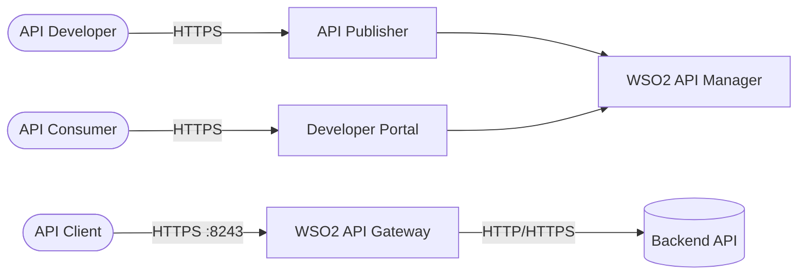
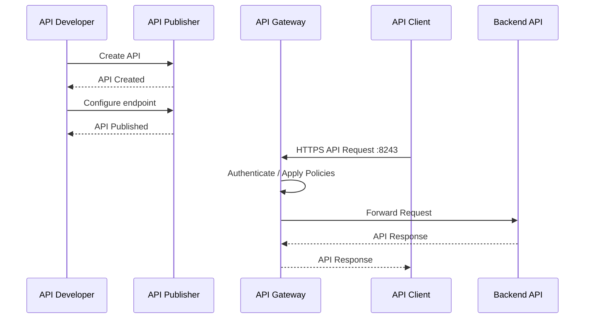
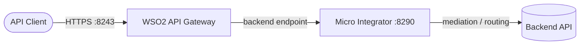

# WSO2 API Manager

WSO2 API Manager (APIM) is an enterprise API management platform for designing, publishing, securing, managing, and consuming APIs.
It provides an API management control plane together with an API gateway for handling API traffic, policies, authentication, subscriptions, and routing.

## How it works





1. API developers create and manage APIs through the **API Publisher**.
2. APIs can be published to the **Developer Portal**, where consumers can discover and subscribe to them.
3. API clients send requests through the **API Gateway** on port `8243`.
4. The gateway applies authentication, authorization, throttling, mediation, and other policies before forwarding requests to the backend.
5. The backend response passes back through the gateway to the API client.

## Stack details in this repo

- Image: `wso2/wso2am:4.7.0`
- Container: `wso2am`
- Gateway HTTPS: `https://localhost:8243`
- Management HTTPS: `https://localhost:9443`
- API Publisher: `https://localhost:9443/publisher`
- Developer Portal: `https://localhost:9443/devportal`
- Admin interface: `https://localhost:9443/admin`
- Default credentials:
  - Username: `admin`
  - Password: `admin`

### Docker ports

| Port | Protocol | Purpose |
|------|----------|---------|
| `8243` | HTTPS | API Gateway |
| `9443` | HTTPS | Management / API-M applications |

## Environment variables

This local setup uses the default WSO2 API Manager configuration and does not require additional environment variables.

| Variable | Default | Description |
|----------|---------|-------------|
| — | — | Uses the default WSO2 APIM configuration |

For production deployments, credentials, certificates, databases, and other configuration should be externalized rather than relying on the development defaults.

## How to run

From the repository root:

```bash
docker compose up -d
```

Check the container:

```bash
docker compose ps
```

Follow the WSO2 logs:

```bash
docker compose logs -f
```

Open the API Publisher:

```text
https://localhost:9443/publisher
```

Open the Developer Portal:

```text
https://localhost:9443/devportal
```

The gateway can be tested with:

```bash
curl -k https://localhost:8243
```

Useful commands:

```bash
docker compose ps
docker compose logs -f
docker compose restart
docker compose down
docker compose down -v
```

## How to use

### Access API Publisher

Open:

```text
https://localhost:9443/publisher
```

Login with:

```text
Username: admin
Password: admin
```

The Publisher is used to:

- Create APIs
- Configure backend endpoints
- Define API resources
- Configure authentication
- Configure throttling policies
- Publish APIs
- Manage API lifecycle and versions

### Create an API

From the Publisher:

```text
Publisher
   |
   +-- Create API
          |
          +-- API Name
          +-- Version
          +-- Context
          +-- Backend Endpoint
          +-- Resources
```

For example:

```text
API Name: Products API
Version: 1.0.0
Context: /products
Backend: http://host.docker.internal:3000
```

The API can then expose resources such as:

```text
GET /products
GET /products/{id}
POST /products
```

### API Gateway flow

Once published, an API request follows the gateway path:

```text
Client
   |
   | HTTPS
   v
localhost:8243
   |
   v
WSO2 API Gateway
   |
   | Authentication
   | Authorization
   | Throttling
   | Policies
   | Routing
   v
Backend API
```

For example:

```bash
curl -k https://localhost:8243/products
```

The gateway receives the request and routes it to the configured backend endpoint.

### Developer Portal

Open:

```text
https://localhost:9443/devportal
```

The Developer Portal allows API consumers to:

- Discover APIs
- View API documentation
- Subscribe to APIs
- Create applications
- Obtain credentials
- Test APIs

## Integrate with WSO2 Micro Integrator (MI)

WSO2 API Manager and the [WSO2 Micro Integrator](../wso2-mi/README.md) are complementary: APIM handles API management (publishing, subscriptions, keys, rate limits, gateway policies), while MI handles integration and mediation (routing, transformation, enrichment) before requests reach the real backend.



### Put both stacks on one network

The two compose projects need a shared Docker network so their containers can resolve each other by name. Create an external network:

```bash
docker network create wso2-integration
```

Then attach it to both stacks by adding this to each `docker-compose.yml`:

```yaml
networks:
  default:
    external: true
    name: wso2-integration
```

With this in place, APIM reaches MI at `http://wso2-mi:8290`, and MI reaches APIM at `https://wso2am:9443` / `https://wso2am:8243` (or `http://wso2am:8280` for the internal HTTP gateway).

In local development both products use the default `wso2carbon` self-signed certificate, so HTTPS between the two containers works without extra truststore configuration.

### Pattern A — Expose an MI integration as a managed API (recommended)

1. Run both stacks on the shared `wso2-integration` network.
2. In the API Publisher, create an API and set its backend endpoint to the MI runtime: `http://wso2-mi:8290/<your-api-context>`.
3. Publish the API.

The gateway enforces authentication, subscriptions, and throttling before forwarding to MI, which applies mediation and routes the request to the real backend:

```text
Client --> APIM Gateway :8243 --> MI :8290 --> Backend
```

### Pattern B — MI calls APIM

MI can also call into APIM (token validation, invoking managed APIs, or using the Publisher/Store REST APIs). From an MI integration artifact, point an endpoint at the APIM service:

| Purpose | URL |
|---------|-----|
| Invoke a managed API via the gateway | `http://wso2am:8280/<api-context>` |
| OAuth2 token endpoint | `https://wso2am:9443/oauth2/token` |
| Publisher REST API | `https://wso2am:9443/api/am/publisher/v4` |
| Developer Portal (Store) REST API | `https://wso2am:9443/api/am/store/v4` |

See the [WSO2 Micro Integrator README](../wso2-mi/README.md) for the matching guide, including an example MI REST API artifact that forwards requests to a backend.

## Use a Cloudflare Origin certificate for TLS

In the APIM + MI topology, TLS is terminated at whichever component is the **entry point**. If Cloudflare routes directly to APIM (the normal case), the origin certificate belongs on **APIM** — the gateway (`8243`) and management (`9443`) listeners. MI only needs its own certificate when it is the origin (see the [MI TLS guide](../wso2-mi/README.md#use-a-cloudflare-origin-certificate-for-tls)).

Unlike MI, APIM distinguishes the TLS keystore from the internal keystore: the HTTPS transports use **`[keystore.tls]`**, while **`[keystore.primary]`** stays untouched for internal token signing. So you can replace the TLS certificate without breaking internal JWT/token trust.

### 1. Create the Origin certificate

In the Cloudflare dashboard: **SSL/TLS → Origin Server → Create Certificate**. Note the hostname(s) it covers. Later set the zone **SSL/TLS encryption mode to `Full (strict)`**.

### 2. Bundle the PEM cert and key into a PKCS12 keystore

Run locally (where `origin.pem` and `origin-key.pem` are your Cloudflare downloads):

```bash
openssl pkcs12 -export -name wso2carbon \
  -in origin.pem -inkey origin-key.pem \
  -out conf/origin.p12 -password pass:<store-pass>
```

Or download the origin certificate directly as PKCS12 from the Cloudflare dashboard. Remember the alias and password. The `.p12` contains the private key — **do not commit it** (see `.gitignore`).

### 3. Mount the keystore and config into the container

The APIM stack has no config mounted yet, so add both the keystore and a `deployment.toml` to `docker-compose.yml`:

```yaml
services:
  wso2am:
    volumes:
      - ./conf/deployment.toml:/home/wso2carbon/wso2am-4.7.0/conf/deployment.toml:ro
      - ./conf/origin.p12:/home/wso2carbon/wso2am-4.7.0/repository/resources/security/origin.p12:ro
```

### 4. Point `[keystore.tls]` at it

`conf/deployment.toml` must start from the image's full default file (extract it with `docker run --rm --entrypoint cat wso2/wso2am:4.7.0 /home/wso2carbon/wso2am-4.7.0/conf/deployment.toml`), then add:

```toml
[keystore.tls]
file_name = "repository/resources/security/origin.p12"
type = "PKCS12"
password = "<store-pass>"
alias = "<alias>"
key_password = "<key-pass>"
```

Keep `[keystore.primary]` and `[truststore]` at their defaults so internal token signing and outbound TLS validation keep working. As with MI, do not override with only this section — the config mapper needs the full base file or startup fails.

### 5. Recreate the container and verify

```bash
docker compose up -d --force-recreate wso2am
openssl s_client -connect localhost:8243 -servername <origin-host> -showcerts
openssl s_client -connect localhost:9443 -servername <origin-host> -showcerts
```

The subject should be your origin hostname and the issuer a **Cloudflare Inc … CA**.

### 6. Route Cloudflare to APIM

Point Cloudflare traffic at the gateway `https://localhost:8243` (e.g. a Cloudflare Tunnel), with the SNI hostname matching the certificate.

### Where each certificate goes

| Hop | Component | Config |
|-----|-----------|--------|
| Client → APIM (`8243`/`9443`) | APIM | `[keystore.tls]` (this guide) |
| APIM → MI (`8290`) | plain HTTP by default | no cert needed |
| Cloudflare → MI directly | MI | `[keystore.primary]` (see [MI TLS guide](../wso2-mi/README.md#use-a-cloudflare-origin-certificate-for-tls)) |

### Caveats

- Origin certificates are trusted **only between Cloudflare and your origin**, not by browsers — direct access to `8243`/`9443` still shows a warning.
- Replacing `[keystore.tls]` only changes the HTTPS listeners; do not replace `[keystore.primary]`, which signs the internal tokens.
- Keep the private key out of the repository. The root `.gitignore` excludes `wso2-am/conf/*.p12` and `wso2-am/conf/*.jks`.

## Architecture


## Notes

- `9443` is the HTTPS management/application port. Accessing `https://localhost:9443/` directly may return `404`; use `/publisher`, `/devportal`, or other application paths instead.
- `8243` is the HTTPS API Gateway port.
- The default `admin/admin` credentials are suitable for local development only.
- The HTTPS certificate is typically self-signed in a local installation, so `curl` may require `-k`.
- When the backend runs directly on the Windows host while WSO2 runs inside Docker, `host.docker.internal` can be used to reach the host from the container.
- For production deployments, configure proper certificates, external databases, secrets, identity providers, clustering, persistence, and security policies.
- WSO2 API Manager is an **API management platform**, not merely an API gateway. The gateway handles runtime API traffic while the management components handle API lifecycle, publishing, subscriptions, policies, and developer consumption.
