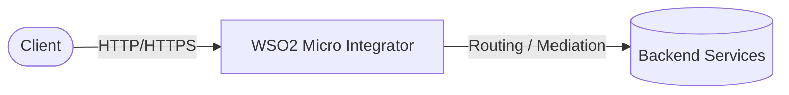
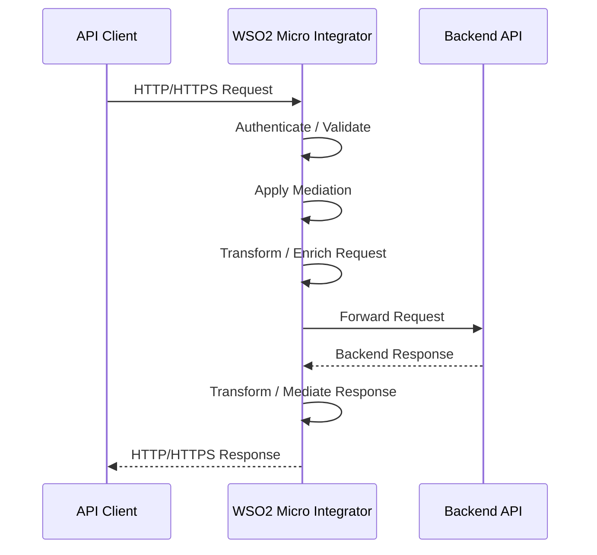
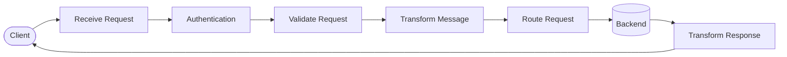
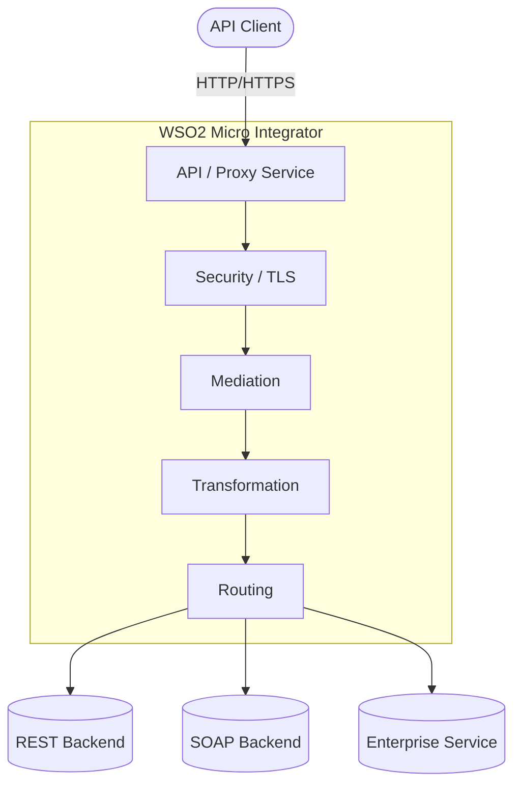

# WSO2 Micro Integrator

WSO2 Micro Integrator (MI) is an enterprise integration and mediation runtime for routing, transforming, securing, and integrating APIs, services, and backend systems.

It is designed for integration and gateway workloads such as HTTP/HTTPS proxying, REST and SOAP services, message mediation, JSON/XML transformation, authentication, routing, filtering, and backend service integration.

## How it works





1. A client sends an HTTP or HTTPS request to Micro Integrator.
2. Micro Integrator receives the request through an API, proxy service, or other integration artifact.
3. Mediation logic can authenticate, validate, transform, enrich, filter, or route the request.
4. The request is forwarded to the configured backend service.
5. The backend response can be mediated or transformed before being returned to the client.

## Stack details in this repo

- Image: `wso2/wso2mi:4.5.0`
- Container: `wso2-mi`
- HTTP integration port: `8290`
- HTTPS integration port: `8253`
- Management/JMX-related port: `9164`

### Docker ports

| Port | Protocol | Purpose |
|------|----------|---------|
| `8290` | HTTP | Integration/API endpoint |
| `8253` | HTTPS | Secure integration/API endpoint |
| `9164` | TCP | Management/JMX-related services |

## Environment variables

This local setup uses the default Micro Integrator configuration.

| Variable | Default | Description |
|----------|---------|-------------|
| — | — | Uses the default WSO2 Micro Integrator configuration |

For production deployments, secrets, certificates, identity providers, databases, and other environment-specific configuration should be externalized.

## How to run

From the repository root:

```bash
docker compose up -d
```

Check the container:

```bash
docker compose ps
```

Follow the logs:

```bash
docker compose logs -f
```

Test the HTTP endpoint:

```bash
curl http://localhost:8290
```

Test the HTTPS endpoint:

```bash
curl -k https://localhost:8253
```

Useful commands:

```bash
docker compose ps
docker compose logs -f
docker compose restart
docker compose down
docker compose down -v
```

## How to use

### Integration architecture

Micro Integrator can act as a gateway or mediation layer between clients and backend services:

```text
Client
   |
   | HTTP/HTTPS
   v
WSO2 Micro Integrator
   |
   +-- Authentication
   +-- Authorization
   +-- Routing
   +-- Filtering
   +-- Transformation
   +-- Enrichment
   +-- Logging
   |
   v
Backend Services
```

### Proxy a backend service

Micro Integrator can expose a proxy endpoint in front of an existing backend:

```text
Client
   |
   | GET /api/users
   v
Micro Integrator
   |
   | GET /users
   v
Backend API
```

This allows the integration layer to perform authentication, header manipulation, request validation, logging, routing, transformation, and error handling.

## Mediation

Mediation is one of the main features that differentiates Micro Integrator from a simple reverse proxy.



Example:

```text
Client JSON
    |
    v
Micro Integrator
    |
    +-- Validate
    +-- Transform JSON -> XML
    +-- Add Headers
    +-- Route
    |
    v
SOAP / XML Backend
```

## REST and SOAP

Micro Integrator supports REST-based services and enterprise SOAP services.

```text
                 WSO2 Micro Integrator
                         |
             +-----------+-----------+
             |                       |
          REST API               SOAP Service
             |                       |
        JSON / HTTP             XML / SOAP
             |                       |
             +-----------+-----------+
                         |
                    Backend Systems
```

## Management Dashboard

Micro Integrator can be managed and monitored through the **WSO2 Micro Integrator Dashboard**.

The dashboard is separate from the Micro Integrator runtime.

```text
                    WSO2 Micro Integrator
                             |
                 +-----------+-----------+
                 |                       |
              Runtime                 Dashboard
                 |                       |
          API / Proxy / Flow       Management UI
                 |                       |
                 +-----------+-----------+
                             |
                         Administration
```

## DataPower comparison

Micro Integrator can be used for workloads similar to the integration and mediation responsibilities commonly handled by IBM DataPower.

| Capability | WSO2 Micro Integrator |
|------------|----------------------|
| HTTP/HTTPS gateway | Yes |
| Reverse proxy | Yes |
| REST APIs | Yes |
| SOAP services | Yes |
| Routing | Yes |
| Request mediation | Yes |
| Response mediation | Yes |
| JSON/XML transformation | Yes |
| Message enrichment | Yes |
| Filtering | Yes |
| Authentication | Yes |
| TLS | Yes |
| Backend integration | Yes |
| Integration flows | Yes |
| Management dashboard | Yes, through MI Dashboard |

The main focus is **gateway, integration, and mediation**, rather than API lifecycle management.

## WSO2 API Manager vs Micro Integrator

Micro Integrator should not be confused with WSO2 API Manager.

```text
                       WSO2
                         |
              +----------+----------+
              |                     |
              v                     v
       API Manager (APIM)    Micro Integrator (MI)
              |                     |
       API Management          Integration
       Developer Portal        Mediation
       API Lifecycle           Routing
       Subscriptions           Transformation
       API Governance          Backend Integration
              |                     |
              v                     v
          API Gateway          Integration Runtime
```

For a **DataPower-like gateway and mediation role**, Micro Integrator is the more relevant WSO2 product.

## Architecture



## Notes

- WSO2 Micro Integrator is different from `wso2/wso2am`, which is the WSO2 API Manager image.
- Micro Integrator focuses on integration, mediation, routing, and transformation rather than API lifecycle management.
- The Micro Integrator runtime does not provide the same Publisher/Developer Portal experience as WSO2 API Manager.
- The Micro Integrator Dashboard is a separate management component.
- `8290` is used for HTTP integration traffic.
- `8253` is used for HTTPS integration traffic.
- The HTTPS endpoint may use a self-signed certificate in a local development environment, so `curl` may require `-k`.
- For production deployments, configure proper certificates, secrets, authentication, logging, monitoring, persistence, and high availability.