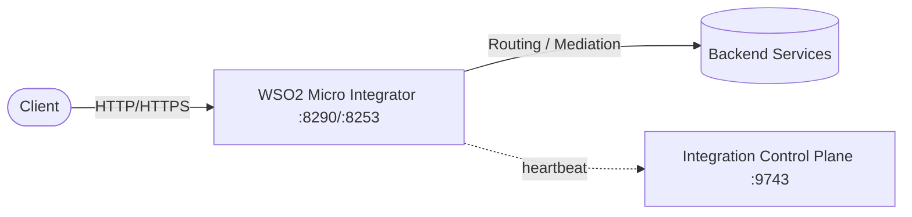
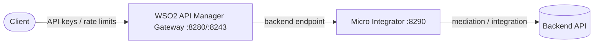
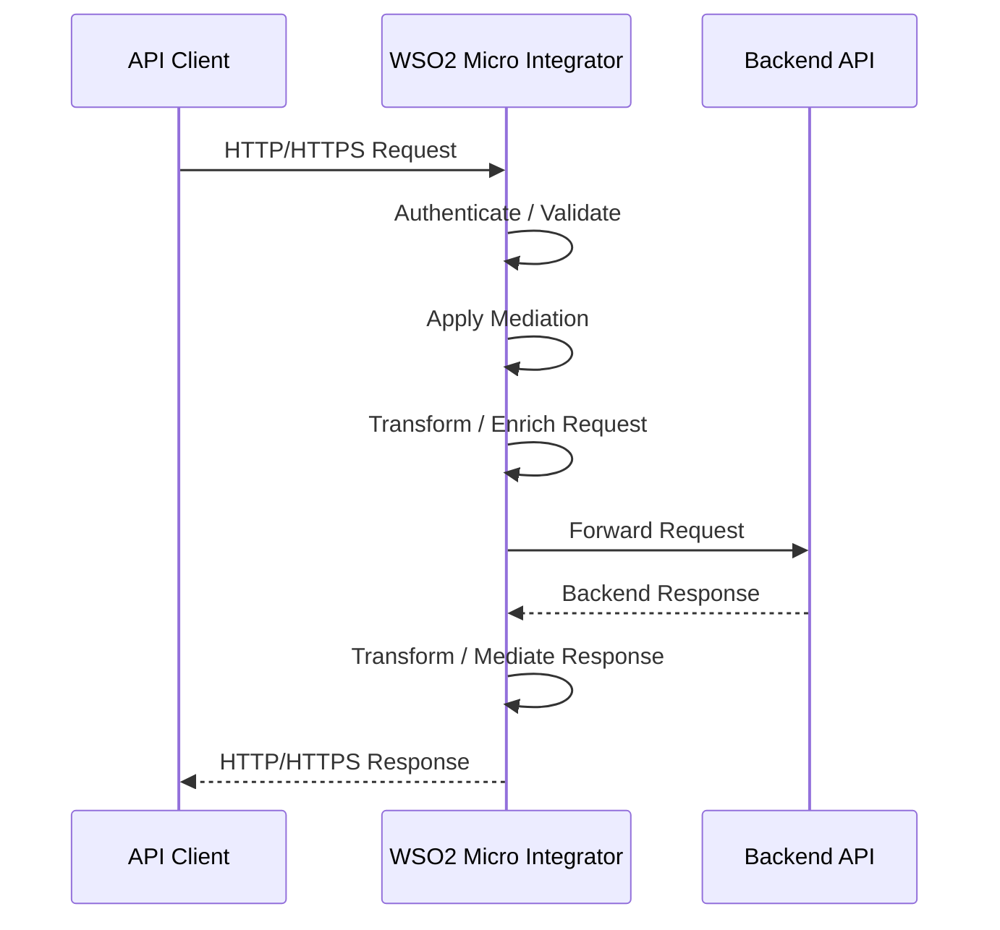

# WSO2 Micro Integrator

WSO2 Micro Integrator (MI) is an enterprise integration and mediation runtime for routing, transforming, securing, and integrating APIs, services, and backend systems.

This docker-compose stack runs **WSO2 MI 4.5.0** together with the **WSO2 Integration Control Plane (ICP)** management dashboard.

## Components

| Service | Image | Purpose |
|---------|-------|---------|
| `wso2-mi` | `wso2/wso2mi:4.5.0` | Integration / mediation runtime |
| `wso2-icp` | `wso2/wso2-integration-control-plane:1.0.0` | Management dashboard |



The MI runtime registers itself with the ICP dashboard through the `dashboard_config` in `conf/deployment.toml`. The ICP connects to the MI over the internal compose network via `https://wso2-icp:9743`.

## Docker ports

| Port | Protocol | Purpose |
|------|----------|---------|
| `8290` | HTTP | Integration / API endpoint |
| `8253` | HTTPS | Secure integration / API endpoint |
| `9164` | TCP | Management / JMX-related services |
| `9743` | HTTPS | Integration Control Plane dashboard |

## How to run

```bash
docker compose up -d
```

Verify:

```bash
docker compose ps
docker compose logs -f
```

## How to use

### 1. Open the management dashboard

- URL: <https://localhost:9743/dashboard/>
- Default login: `admin` / `admin`

The dashboard shows the connected MI node, its status, and lets you browse deployed artifacts and manage integrations.

### 2. Deploy integration artifacts

Mount a local folder of integration artifacts (`.car` composite apps, `.jar`, `.xml`) into the MI deployment directory. Add a volume to `docker-compose.yml`:

```yaml
services:
  wso2-mi:
    volumes:
      - ./conf/deployment.toml:/home/wso2carbon/wso2mi-4.5.0/conf/deployment.toml:ro
      - ./artifacts:/home/wso2carbon/wso2mi-4.5.0/repository/deployment/server:ro
```

Place your artifacts (e.g. `artifacts/carbonapps/MyCompositeApp.car`) in the mounted folder, then restart:

```bash
docker compose restart wso2-mi
```

Any deployed API, proxy service, or endpoint becomes available on the integration ports (`8290` HTTP / `8253` HTTPS).

### 3. Test the endpoints

```bash
# HTTP integration endpoint
curl http://localhost:8290

# HTTPS integration endpoint (self-signed cert in local dev)
curl -k https://localhost:8253
```

A 404 response is expected until you deploy integration artifacts.

### 4. Connect a backend API

MI forwards and mediates requests to a backend service. The backend is referenced from an integration artifact by an endpoint. On a shared compose network, containers are reachable by their service name, so no host port mapping is required for the backend.

Add a backend service to `docker-compose.yml`:

```yaml
services:
  backend:
    image: <your-backend-image>
    container_name: backend
    restart: unless-stopped
    # no ports needed - reachable by MI over the compose network at http://backend:<port>
```

Create a REST API artifact, e.g. `artifacts/synapse-configs/default/api/OrderAPI.xml`:

```xml
<?xml version="1.0" encoding="UTF-8"?>
<api xmlns="http://ws.apache.org/ns/synapse"
     name="OrderAPI"
     context="/orders">
    <resource methods="GET" uri-template="/">
        <inSequence>
            <log level="full"/>
            <send>
                <endpoint>
                    <address uri="http://backend:8080/orders"/>
                </endpoint>
            </send>
            <outSequence>
                <send/>
            </outSequence>
            <faultSequence>
                <log level="full">
                    <property name="MESSAGE" value="Backend call failed"/>
                </log>
            </faultSequence>
        </inSequence>
    </resource>
</api>
```

With the `./artifacts` volume from step 2 mounted, restart MI and call the API:

```bash
docker compose restart wso2-mi
curl http://localhost:8290/orders
```

Notes:

- The `<address uri="...">` endpoint points at the backend. Use `https://` URIs for TLS backends (self-signed certs may require certificate trust configuration in the MI truststore).
- For more advanced routing (load balancing, failover, dynamic URLs, path/query param templating), use `<loadbalance>`, `<failover>`, or template endpoints.

### 5. Integrate with WSO2 API Manager (APIM)

MI and WSO2 API Manager (`wso2/wso2am`) serve different roles and are commonly used together.



Add APIM to the stack:

The full APIM stack lives in `../wso2-am/` and runs `wso2/wso2am:4.7.0` (service name `wso2am`). For the two stacks to reach each other, run both on a shared external Docker network:

```bash
docker network create wso2-integration
```

Add this network to both `docker-compose.yml` files (this stack and `../wso2-am/docker-compose.yml`):

```yaml
networks:
  default:
    external: true
    name: wso2-integration
```

**Pattern A — APIM manages the API, MI does the integration (recommended)**

1. In the APIM Publisher, create an API and set its **backend endpoint** to the MI service: `http://wso2-mi:8290/<your-api-context>`.
2. Clients call the APIM gateway (`https://localhost:8243/<api-context>`), which enforces authentication, subscriptions, and rate limits.
3. The gateway forwards to MI on `8290`, where mediation logic routes the request to the real backend.

**Pattern B — MI calls APIM**

MI can also call into APIM (e.g. token validation, subscribing to managed APIs, or invoking gateway APIs). Point MI endpoints at the APIM service:

| Purpose | URL |
|---------|-----|
| Invoke a managed API via the gateway | `http://wso2am:8280/<api-context>` |
| OAuth2 token endpoint | `https://wso2am:9443/oauth2/token` |
| Publisher REST API | `https://wso2am:9443/api/am/publisher/v4` |
| Developer Portal (Store) REST API | `https://wso2am:9443/api/am/store/v4` |

Note: in local development both products use the default `wso2carbon` self-signed certificate, so HTTPS between the two containers works without extra truststore configuration. See the [WSO2 API Manager README](../wso2-am/README.md) for the APIM-side setup.

### 6. Configure the MI runtime

Runtime settings live in `conf/deployment.toml`, which is mounted read-only into the container.

```toml
[dashboard_config]
dashboard_url = "https://wso2-icp:9743/dashboard/api/"
heartbeat_interval = 5
group_id = "mi_dev"
node_id = "mi_node_1"
```

- `dashboard_url` must use the compose service name `wso2-icp` so the MI can reach the ICP on the internal network.
- `group_id` / `node_id` let you group and identify MI nodes in the dashboard.
- The file must keep the base sections (`[server]`, `[user_store]`, `[keystore.primary]`, `[truststore]`) — removing them causes the container to crash on startup (see Troubleshooting).

## Useful commands

```bash
docker compose ps                    # container status
docker compose logs -f               # follow logs for all services
docker compose logs -f wso2-mi       # follow MI logs only
docker compose restart wso2-mi       # restart after config/artifact changes
docker compose down                  # stop and remove containers
docker compose down -v               # stop and remove containers + network
```

## Troubleshooting

**Container keeps restarting with `Configuration with key server.hostname doesn't exist`**

The mounted `conf/deployment.toml` must contain the base configuration sections. If it only overrides a subsection (e.g. only `[dashboard_config]`), the config mapper cannot resolve internal references like `server.hostname` and the container exits. Restore the base sections:

```toml
[server]
hostname = "localhost"

[user_store]
type = "read_only_ldap"

[keystore.primary]
file_name = "repository/resources/security/wso2carbon.jks"
password = "wso2carbon"
alias = "wso2carbon"
key_password = "wso2carbon"

[truststore]
file_name = "repository/resources/security/client-truststore.jks"
password = "wso2carbon"
alias = "symmetric.key.value"
algorithm = "AES"

# ... then your overrides
```

Then recreate the container so the volume is re-read:

```bash
docker compose up -d --force-recreate wso2-mi
```

## Mediation and integration architecture



1. A client sends an HTTP or HTTPS request to Micro Integrator.
2. Micro Integrator receives the request through an API, proxy service, or other integration artifact.
3. Mediation logic can authenticate, validate, transform, enrich, filter, or route the request.
4. The request is forwarded to the configured backend service.
5. The backend response can be mediated or transformed before being returned to the client.

## Notes

- WSO2 Micro Integrator is different from `wso2/wso2am` (WSO2 API Manager). MI focuses on integration, mediation, routing, and transformation rather than API lifecycle management.
- The Micro Integrator Dashboard / Integration Control Plane is a separate management component (`wso2-icp`).
- The HTTPS endpoints use a self-signed certificate in local development, so `curl` may require `-k`.
- For production deployments, configure proper certificates, secrets, authentication, logging, monitoring, persistence, and high availability.
